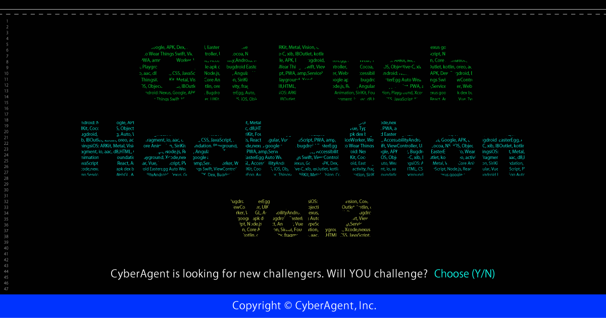

# 

Read this in other languages: [English](./README.en-US.md)

株式会社サイバーエージェントが主催する、Web / iOS / Androidエンジニア向け学生限定ハッカソンです。  
成果物をレポジトリにpushするだけのリモート参加型のイベントです。

## エントリー方法

こちらの[エントリーフォーム](https://goo.gl/forms/RnCT5dQ1ERvgTmz23)を記載して送信するだけでエントリー完了になります。  
参加対象者は、学生のみとなりますので学校のメールアドレスが必要となります。学生以外の方は受け付けておりませんので、あらかじめご了承ください。

## ハッカソン参加の流れ

1. エントリーフォームを記載
2. CyberAgent/git-push-hackathon リポジトリをfork
3. forkした自身のリポジトリでGitHubアカウント名のフォルダを作成し、そこでアプリを開発
4. 開発終了後、CyberAgent/git-push-hackathon リポジトリに自分のGitHubアカウント名のフォルダごとプルリクを出す

**※プルリクが出た時点で開発終了となります。**  
**※チームでの参加は歓迎致しますが評価の都合上、最優秀賞、優秀賞の贈呈は出来ません。最低要件まででも構いませんので、ぜひ個人での参加をお待ちしております。**

## お題

指定のGitHub APIを使用して、GitHubクライアントアプリケーションを開発してください。

### 最低要件

- GitHubのOAuthを用いたログインができる
- [/gists API](https://developer.github.com/v3/gists/)を用いた機能がある
  - gistの一覧表示ができる
  - gistを投稿できる

### 開発について

評価のためにこちらでプロジェクトをビルドする際、依存解決などの工程が必要な場合は、自身のフォルダにREADMEを作成し工程を記載してください。  
ツールなどによって作成された依存パッケージは、リポジトリに含めなくても構いません。  
こちらでビルドする際に、**依存を解決できなかった場合も審査対象になりません** のでご注意ください。  

アプリの作成に使用するClient IDやClient Secretは、ご自身で作成してください。  
評価のためにビルドする際は、こちらで作成したものを使いますのでリポジトリに含めないようにし、READMEにClient IDやClient Secretを記載するべき箇所、またはファイル名を記載してください。  
**Client Secretをコミットしないようにお気をつけください**

### 開発について

評価のためにこちらでプロジェクトをビルドする際、依存解決などの工程が必要な場合は、自身のフォルダにREADMEを作成し工程を記載してください。  
ツールなどによって作成された依存パッケージは、リポジトリに含めなくても構いません。  
こちらでビルドする際に、**依存を解決できなかった場合も審査対象になりません** のでご注意ください。  

アプリの作成に使用するClient IDやClient Secretは、ご自身で作成してください。  
評価のためにビルドする際は、こちらで作成したものを使いますのでリポジトリに含めないようにし、READMEにClient IDやClient Secretを記載するべき箇所、またはファイル名を記載してください。  

## 期間

- 募集期間: **2018/09/07 12:00:00 +09:00 ~ 2018/10/23 11:59:59 +09:00**
- 開催期間: **2018/10/09 12:00:00 +09:00 ~ 2018/10/23 11:59:59 +09:00**

※ 募集期間内であれば参加いただけます。  
※ 開催期間を過ぎたプルリクエストは対象外とさせていただきます。

## 評価について

### 評価ポイント

創意工夫していただきたい、評価ポイントは以下です。ポイントが高い順に記します。

1. 設計
2. 最新技術、言語仕様を正しく用いた実装
3. UI/UXへのこだわり
4. その他各々の工夫・こだわり（プルリクエストにて説明したものを見ます）
  - 例: パフォーマンス、アクセシビリティ、セキュリティ、etc...

### 評価対象外

以下の基準を満たしていない場合は、評価いたしません。

- お題の最低要件を満たしていない
- ビルドができない
- コピペだと思われるソースコードの使用

締め切り後、各クライアントで評価を行い、優秀者の決定を行います。結果はメールにてお知らせいたします。

## 賞品

### 最優秀賞 (各クライアントから1人ずつ)

**賞金30万円** + 現場で活躍するエンジニアとの会食 (地方からの参加の場合、交通費、宿泊費付き)

### 優秀賞

現場で活躍するエンジニアとの会食 (地方からの参加の場合、交通費、宿泊費付き)

## FAQ

質問などがあれば issue を作成してください。  
回答済みのissueはCloseせずに残していただきて構いません。

### 主催者

- [kaelaela](https://github.com/kaelaela)
- [shaunkawano](https://github.com/shaunkawano)
- [shoheiyokoyama](https://github.com/shoheiyokoyama)
- [ryo_suga](https://github.com/RyotaSugawara)

---
[](https://kuxu.visualstudio.com/GistViewerForAndroid/_build/latest?definitionId=5)

# 頑張ったところをリストアップしてみる

- マルチモジュールを基本としたアプリ設計
- 内部設計は、 MVVM + Clean Architecture + α
- JetPack(AAC) の積極的導入と活用
- 内部でのメッセージング、非同期処理のつらみ解消のために Rx + Kotlin Coroutine の活用
- 画面遷移は 1Activity, Multi Fragment、jetPack の Navigatiion Component の活用
- (あまり書けなかったけど) JUniit + Mockito + Spek での単体テストの記述

# 利用しているライブラリ一覧

- RxJava
- Navigation Component
- Safe Args   
  takahirom さんがツイートしてたこのライブラリですね。
  https://twitter.com/new_runnable/status/1052932598316466177
- ViewModel
- LiveData
- Kotlin Coroutine
- Moshi
- JUnit
- glide
- koin
- Fuel

# 実装したアプリの機能

## ホーム画面
- Gist の名前を確認できる
- Gist に含まれるファイル名を確認できる
- Gist がお気に入り登録されているか確認できる
- Gist をタップをするとGist 詳細画面へ遷移することができる
- 右下のFAB からGist 投稿画面へ遷移できる

## Gist 投稿画面
- Gist のタイトルをつけることができる
- Gist のファイルをタイトルとコンテンツをつけて追加することができる
- 投稿することができる
- 投稿する時・ファイル追加時に空欄だったりすると警告表示をすることができる

## Gist　詳細画面
- 読み込み中はProgressRing を表示することができる
- お気に入り状態を確認することができる
- お気に入り状態を編集することができる
- 投稿者の名前を確認することができる
- 投稿日時を確認することができる
- Gist のファイルサイズを確認することができる

# 動かす時の注意点

```
Callback を
gist-viewer://login
に指定したアプリの
 clientId,clientSercret を入れてください
 入れる場所等は下記の画像にて解説してあります。
 ```

# 図解してみる


# 詳細なスライドについて

https://www.icloud.com/keynote/0pkcSrb4Xhhbv6e_ntoVHv3Jw

