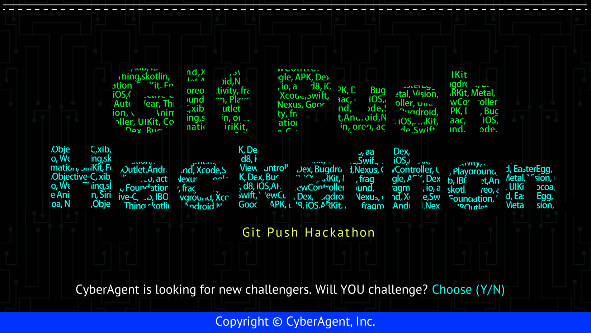

*Read this in other languages: [English](README.en-US.md)*

株式会社サイバーエージェントが主催する、ネイティブエンジニア向け学生限定ハッカソンです。成果物をレポジトリにpushするだけのリモート参加型のイベントです。

## エントリー方法

こちらの[エントリーフォーム](https://docs.google.com/forms/d/1ZIszYGW0RvmZhBQu4KDWBAaGa2Wnwu69EfRamZ7xat4/viewform?edit_requested=true)を記載して送信するだけでエントリー完了になります。
参加対象者は、学生のみとなりますので学校のメールアドレスが必要となります。学生以外の方は受け付けておりませんので、あらかじめご了承ください。

## ハッカソン参加の流れ

1. 上記のエントリーフォーム記載
2. CyberAgent/git-push-hackathonレポジトリをフォーク
3. フォークした自身のレポジトリでGitHubアカウント名のフォルダを作成し、そこでアプリを開発
4. **開発終了後**、CyberAgent/git-push-hackathonレポジトリに自分のGitHubアカウント名のフォルダごとプルリクを出す

**※プルリクが出た時点で開発終了となります。**  
**※チームでの参加は歓迎致しますが評価の都合上、最優秀賞、優秀賞の贈呈は出来ません。最低要件まででも構いませんので、ぜひ個人での参加をお待ちしております。**

## お題

[GitHub API](https://developer.github.com/v3/)を使用して、GitHubクライアントアプリケーションを開発してください。

### 最低要件

下にあるGIF画像の挙動を参考に、

- OAuth認証を用いたログイン
- [activity/events API](https://developer.github.com/v3/activity/events/)を用いたイベントの一覧表示

を実装してください。

### 開発について

評価のためにこちらでプロジェクトをビルドする際、依存解決などの工程が必要な場合は、自身のフォルダにREADMEを作成し工程を記載してください。  
ツールなどによって作成された依存パッケージは、リポジトリに含めなくても構いません。  
こちらでビルドする際に、**依存を解決できなかった場合も審査対象になりません** のでご注意ください。  

アプリの作成に使用するClient IDやClient Secretは、ご自身で作成してください。  
評価のためにビルドする際は、こちらで作成したものを使いますのでリポジトリに含めないようにし、READMEにClient IDやClient Secretを記載するべき箇所、またはファイル名を記載してください。  

### sample

|iOS|Android|
|:---:|:---:|
|||

## 締め切り

2018/02/28 23:59 (JST)

## 評価について

### 評価ポイント

創意工夫していただきたい、評価ポイントは以下です。ポイントが高い順に記します。

1. 設計
2. 最新技術、言語仕様を正しく用いた実装
3. UI/UXへのこだわり(+α要素として評価)

### 評価対象外

以下の基準を満たしてない場合は、評価をしません。

- お題の最低要件を満たしていない
- ビルドができない
- コピペだと思われるソースコードの使用

締め切り後、各OSで評価を行い、優秀者の決定を行います。結果はメールにてお知らせします。

## 賞品

### 最優秀賞（iOS, Android各1名）

**賞金30万円** ＋ 現場で活躍するネイティブエンジニアと会食（地方から参加の場合、交通費、宿泊費付き）

### 優秀賞（複数人選定させていただく場合がございます）

現場で活躍するネイティブエンジニアと会食（地方から参加の場合、交通費、宿泊費付き）

## FAQ

質問などあれば[issueを作成](https://github.com/CyberAgent/git-push-hackathon/issues/new)してください。  
回答済みのissueはCloseせずに残していただいて構いません。

## クレジット
- [CodeHub - A Client for GitHub / Dillon Buchanan](https://itunes.apple.com/jp/app/codehub-a-client-for-github/id707173885?mt=8)
- [FastHub for GitHub / Fast Access](https://play.google.com/store/apps/details?id=com.fastaccess.github)

## 主催者

- [kaelaela](https://github.com/kaelaela)
- [shaunkawano](https://github.com/shaunkawano)
- [ra1028](https://github.com/ra1028)
- [shoheiyokoyama](https://github.com/shoheiyokoyama)
- [kazk1018](https://github.com/kazk1018)
