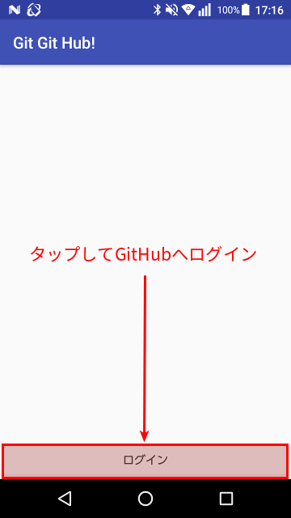
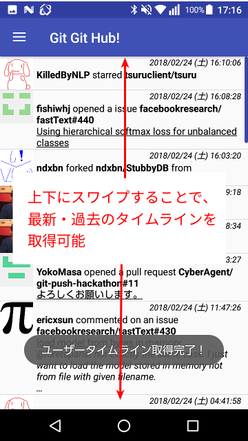
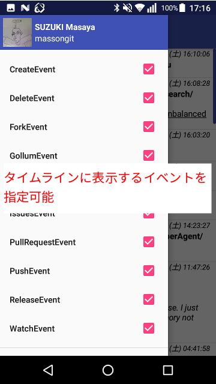
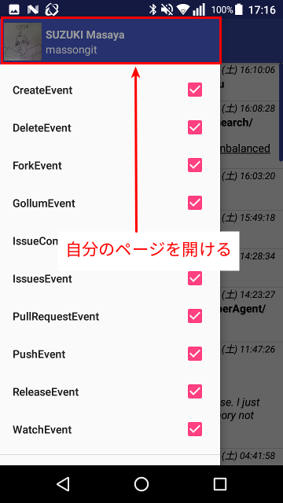

## 対象プラットフォーム
Android 5.1 以降

## 開発言語
Kotlin 1.2.21

## 開発環境
* Ubuntu 16.04 LTS
* Android Studio 3.0.1

## 導入手順
1. `git clone https://github.com/CyberAgent/git-push-hackathon`
1. `cd git-push-hackathon`
1. `git submodule update -i`
1. `cd massongit`
1. 以下のように`app/src/main/res/values/callback_urls.xml`を作成
    * [例] GitHub APIのコールバックURLが`massonurl://github.io/callback`の場合

   ```app/src/main/res/values/callback_urls.xml
   <?xml version="1.0" encoding="utf-8"?>
   <resources>
       <string name="callback_url_scheme" translatable="false">massonurl</string>
       <string name="callback_url_host" translatable="false">github.io</string>
       <string name="callback_url_path" translatable="false">/callback</string>
   </resources>
   ```

1. 以下のように`app/src/main/res/values/github_apis.xml`を作成
   ```app/src/main/res/values/github_apis.xml
   <?xml version="1.0" encoding="utf-8"?>
   <resources>
       <string name="client_id" translatable="false">{GitHub APIのClient ID}</string>
       <string name="client_secret" translatable="false">{Git Hub APIのClient Secret}</string>
   </resources>
   ```

1. プロジェクトをビルド  
(`app/src/main/res/menu/navigation_view_main_menu.xml`が生成される)

## 機能
### ログイン画面

### メイン画面 
  
  
  

#### ナビゲーションメニュー
  
  

