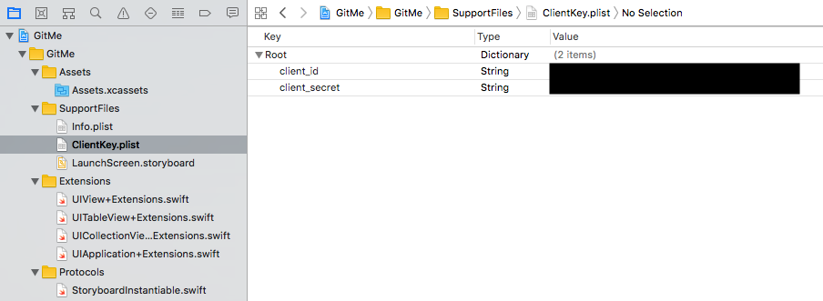
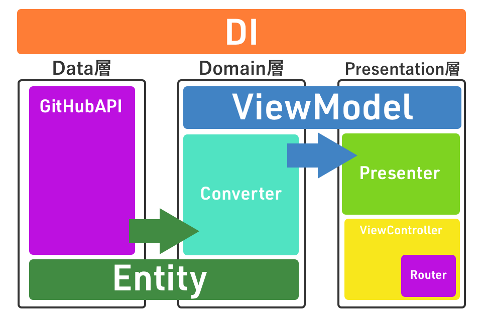

# Git Push Hackathon

touyou（藤井陽介）のプロジェクトです。

## プロジェクト構成

- GitMe ... iOS版
- GitMeAndroid ... 同様の設計でのAndroid移植（今回の提出期間内にはできなかったのでロジックの一部のみ移植されていますが、最低要件を満たしていないので無視して頂いて大丈夫です。引き続き時間のある時にdevelopブランチで製作していく予定です。）
- Assets ... 共通のアセット一式が入っています。
- GitMe.sketch ... デザインを行ったファイルです。

## 使用方法

iOS版は最初にフォルダ内で

```
$ make
```

をしてCarthageのライブラリをインストールしてください。

その後プロジェクトのSupportFilesの中に`ClientKey.plist`を作成し、Root直下に`client_id`をKeyにClient IDのStringと、`client_secret`をKeyにClient SecretのStringを追加してください。

以下のようになっていれば大丈夫です。



## 要件

- iOS11以上

## 機能

今回は普段自分がWebのGitHubや、CodeHubを実際に使う中で感じていた「タイムラインの情報の消化のしにくさ」を解消するべく最低要件に加えて独自の機能をつけています。
具体的には、自分はこの「情報の消化のしにくさ」がアクションを起こした人、アクションの種類、リポジトリの名前しかわからない（Webのほうはこれに加えDescription）ところからくると考え、もっとリポジトリ一個一個の個性がタイムラインの時点でわかるという状態を目指すべくREADMEを見れる機能をタイムライン上に追加しました。

普段は隠れて邪魔をセず、READMEのあるものはWatch READMEというViewが出てくるのでそれをタップすることでスクロールして見れるREADMEのプレビューを開くことが出来ます。

その他ログアウト機能も搭載しています。

## 設計

設計はiOS Clean Architectureをベースに独自にわかりやすさと管理のしやすさを目指して変更を加えたものを使用しています。
大まかな構成が以下のような形です。



まずClean Architecture同様、大きくわけて３つの層に分かれています。これがData層、Domain層、Presentation層です。これをシングルトンを用いた簡単なDIによって管理しています。

そして大きく層を横断して使われているのがその層で使われるデータの形式です。こちらのRxによるObservableが矢印の方向に受け渡されていって主にPresenter、一部がViewControllerによって購読されます。

基本はRxの購読によりデータが流れるという形ですが、各段階ではシングルトンパターンを除き依存度を一方向にするためにProtocolを用いて必要な関数のみ呼び出せるようになっています。これを明示的に示すため、Protocolで使われる部分はextensionに切り出し、内部で使う関数にはすべて明示的にprivateを指定しています。

### Data層

まず一番の変更が加わっているのがData層の部分です。ここで一般のClean Architectureでは分割されるローカルやネット通信をシングルトンによって一元管理するようにしました。これによってURLSessionやJSONDecoder、キャッシュとして利用したUserDefaultsが共通化でき簡潔なコードになっています。
EntityにおいてはSwift4のCodableをフル活用しています。CodableとJSONDecoderを用いることによって最低限の記述でエラーなくネットワークから得られたJSONをEntityに変換することができます。こちらは次のSwiftアップデートでCodingKeysを書かなくてもできるようになるので将来的にはさらに簡潔になると考えられます。

### Domain層

Domain層の責務はかなり少なく、基本的にEntityからViewModelへのObservableのmap操作を担っています。これを行うのが各画面に対応したConverterで、GitHubAPIのシングルトンはConverterでのみ呼び出されます。

### Presentation層

Presentation層のみ他の層と違ってさらに中で大きく２つにわかれています。まずPresenterがデータやロジック部分とのやりとりを担当しています。DataSourceも同時に引き受けるのでデータ自体がViewControllerに受け渡されることはありません。
一方ViewControllerではユーザーとのインタラクションすべてを引き受けます。つまりUITableViewDelegateもこちらに適応されています。
こうすることによって完全にレイアウトに関するロジックとデータを処理するロジックを切り分けて考えられるようになっています。

またViewControllerたちにはそれらをまとめているベースの画面となっているTabBarControllerを介してRouterを呼び出すことができます。これは画面間の移動部分のロジックがまとめられておりこれによって複雑なUIWindowを重ねたポップアップ表示などを隠蔽することができています。

### 全体として

以上がメイン部分の大雑把な説明となります。これに加えてiOS版ではProtocolとExtensionを活用することによってなるべくサードパーティ製ライブラリへの依存度を低くしています。
以下がその一覧です。

#### サードパーティ製ライブラリ

- [RxSwift / RxCocoa](https://github.com/ReactiveX/RxSwift) ... Rxを導入しているため
- [OAuthSwift](https://github.com/OAuthSwift/OAuthSwift) ... OAuth2認証を簡潔に書くため
- [PINRemoteImage](https://github.com/pinterest/PINRemoteImage/) ... 画像の非同期表示としては機能の多さからこちらを選択してみました
- [Down](https://github.com/iwasrobbed/Down) ... Markdownの表示のため

#### Protocol

- StoryboardInstantiable
- NibLoadable
- Reusable

Storyboard分割、nib読み込みを簡易にする定番のプロトコルに一部さらに書き方が簡潔になるよう改良を加えて使用しています。

#### Extensions

- UIView+Extensions ... 角丸、ボーダー、影の設定項目をIBInspectableで定義しています
- UITableView+Extensions, UICollectionView+Extensions ... 定番ですがセルの再利用まわりの記述を簡潔にするメソッドが入っています。それに加えて今回タイムラインREADME表示の機能のUX向上のために一箇所と全体どちらのreloadにも使える関数が実装されています
- UIApplication+Extensions ... 一番前にあるViewController、NavigationController、TabBarControllerが簡単に取れるようになっています
- URL+Extensions ... クエリを追加するユーティリティメソッドが実装されています
- UIColor+Extensions ... プロジェクトカラーの構造体と16進数からできるconvenience initを実装しています。これを活用したStringにUIColorをとれるプロパティも追加しています
- Date+Extensions ... 各種文字列への変換プロパティが追加されています
- UINavigationController+Extensions ... NavigationBarのセットアップメソッドが書かれています
- UserDefaults+Extensions ... 今回は使用していませんがUIImageを安全に、他の型同様保存できるようなメソッドを作成しました
- NSMutableAttributedString+Extensions ... イベントの複雑な文字レイアウトを簡潔に記述するためスタイルと文字のタプルの配列を受け渡すことで簡単にNSAttributedStringが作成できるメソッドを用意しました
- UIAlertController+Extensions ... addActionとshowを簡潔に書けるようにしています
- UITabBarController+Extensions ... メインのViewControllerが簡単にとれるプロパティを用意しています

## おまけ：デザインについて

デザインは最近のトレンドを取り入れてカード形式の[Complexion Reductionデザイン](https://medium.com/amazing-stuff/complexion-reduction-a-new-trend-in-mobile-design-cef033a0b978)を採用してみました。UI/UXを組むのも好きなのでSketchで1からデザインして実装しています。
リポジトリの詳細やREADMEを別個で読み込むことにすると扱うObservableの簡潔さとのトレードオフが生じてしまいましたが、UXを優先し各セルごとに情報が来たら更新という形をとっています。
